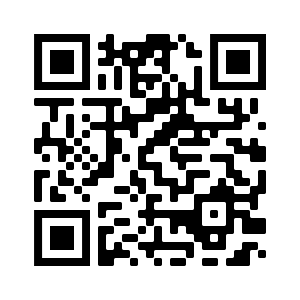
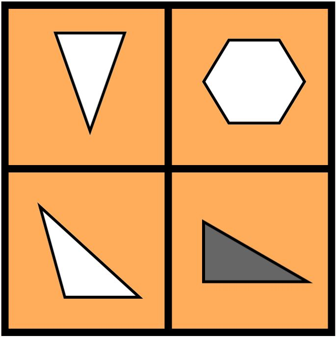
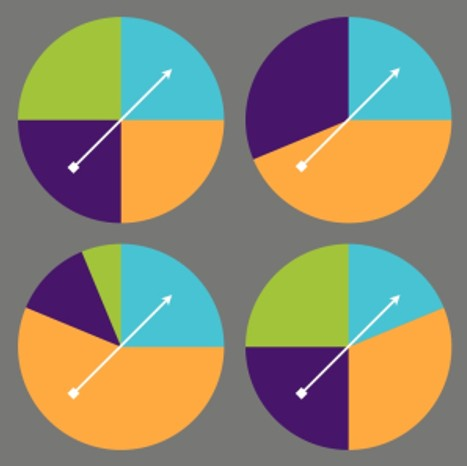
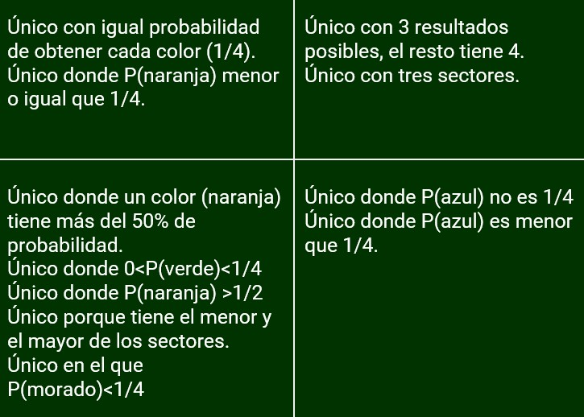

# Acceso a la presentación {data-background-image="assets/computer.jpg" data-background-opacity="0.18"}

## {data-background-image="assets/computer.jpg" data-background-opacity="0.18"}

{width=45%}

[https://pbeltran.github.io/2020-mguzman-rpstat](https://pbeltran.github.io/2020-mguzman-rpstat)

# Introducción {data-background-image="assets/computer.jpg" data-background-opacity="0.18"}

## Contenidos del taller

> Se trata de explorar una propuesta virtual que, con sus limitaciones evidentes, intenta ser coherente con un enfoque de enseñanza y aprendizaje a través de la resolución de problemas.

1. Esta introducción, que continúa exponiendo brevemente qué es esto del _a través_ de la resolución de problemas.
2. Una actividad sobre dispersión, donde la tarea a completar es grabar un vídeo de 3-5 minutos.
3. ¿Cuál es el que no encaja? Aquí la tarea consiste en diseñar un WODB, proponerlo en el foro y contestar, por lo menos, a cuatro compañeros.
4. Charlas de aula sobre gráficos estadísticos: qué pasa con este gráfico y gráficos que se revelan poco a poco. Aquí hay que elegir uno de los tipos de actividad para hacer la tarea, que consiste en entregar un pequeño documento.

## Enseñanza a través de la resolución de problemas

Sintetizando mucho, este enfoque consiste en utilizar problemas (en sentido amplio, tareas o situaciones-problema) para que emerja el contenido matemático. Mediante el trabajo en pequeños grupos y las posteriores puestas en común, el docente 

##

De hecho, también hay consenso en que lo ideal es vertebrar los contenidos a través de la resolución de problemas. English y Gainsburg (2016) se expresan así:

>Hemos descrito un debate de décadas sobre la enseñanza de la resolución de problemas frente a la enseñanza a través de la resolución de problemas. El conocimiento del contenido matemático en sí mismo casi nunca es una demanda explícita por parte de los empresarios. Ahora bien, estos desean trabajadores que sean resolutores eficientes de problemas, lo que implícitamente conduce a los centros educativos a enseñar la resolución de problemas como un fin en sí mismo. 

::: notes

Empresarios, aquí podríamos hablar de lo que es una visión utilitarista y otra más humanista. Pero eso es otra historia.

:::

##

>Por lo tanto, a pesar de la reciente tendencia de la comunidad de educación matemática hacia la resolución de problemas como vehículo para el aprendizaje del contenido matemático, recomendamos cumplir ambos objetivos.

##

>Abogamos por reestructurar este debate para preguntar, en cambio, cómo podemos diseñar problemas que sean lo suficientemente exigentes desde el punto de vista cognitiva, como para fomentar tanto el contenido matemático significativo como las competencias de resolución de problemas. Para empezar, podríamos considerar la redefinición de la resolución de problemas como una experiencia en la que el resolutor o un grupo cooperativo "necesita desarrollar una estrategia matemática más productiva de pensar sobre la situación dada" (Lesh y Zawojewski, 2007, p. 782).

# D1: ¿Cuál es el que no encaja? (WODB)

## ¿Qué esto de los WODB?

{width=25%}

Todo comienza con el libro:

> Danielson, C. (2016). Which One Doesn't Belong. Portland, Maine: Stenhouse.

Desde entonces, el uso de este recurso se ha popularizado y ha aparecido una web especializada en esto:

[www.wodb.ca](https://wodb.ca/)

## Vamos a pensar un poquito

>¿Cuál crees que es el que no encaja?

:::::::::::::: {.columns}

::: {.column width="25%"}

{width=100%}

Imagen: [www.wodb.ca](http://wodb.ca/) 

(Pam Wilson)
:::

::: {.column width="70%"}

No hagas trampa y no continúes hasta que hayas pensado algo

:::incremental

- ¿El 43 porque es el único primo?
- ¿El 16 porque es múltiplo de 4? 
- ¿El 43 porque no es un cuadrado perfecto?
- ¿El 9 porque la suma de sus cifras no es 7?
- ¿El 9 porque solo tiene una cifra?
- Etc.
- Siempre hay _al menos_ una razón para hacer único a cada elemento.
:::

:::
::::::::::::::

## Un ejemplo de charla de "aula"
:::::::::::::: {.columns}

::: {.column width="55%"}
En clase, lo que suele hacerse es proyectar el WODB y:

- Si se tiene pizarra digital, se escriben las razones que van aportando sobre el mismo.
- Si no se tiene PDI, entonces se traza una cruz grande en la pizarra para anotar lo que dice el alumnado para cada uno de los elementos.
:::

::: {.column width="45%"}

{width=50%}

Imagen: [www.wodb.ca](http://wodb.ca/) 

(Mary Bourassa)

:::
::::::::::::::

> Aquí tenéis un vídeo que he grabado con dos niños, de 7 y 9 años, hablando sobre ese WODB de geometría.

[Enlace al vídeo](https://www.youtube.com/watch?v=5jNRjAtb5pc)

## Un ejemplo de probabilidad

:::::::::::::: {.columns}

::: {.column width="30%"}

{width=100%}

Imagen: [www.wodb.ca](http://wodb.ca/) 

(Chris Hunter)

:::

::: {.column width="65%"}

{width=100%}

Esto es solo un ejemplo. Un mismo WODB, como este, puede proponerse desde infantil hasta bachillerato, y el vocabulario y argumentos empleados varían enormemente.

:::
::::::::::::::

## ¿Cómo diseñar un WODB?

Un buen WODB exige una pequeña labor de diseño. Hunter (2018), propone usar una tabla, donde se especifican cuatro propiedades, de manera que cada elemento del WODB ha de cumplir una, y solo una. Pone como ejemplo el WODB de de la diapositiva anterior:

|                  	|    Tres sucesos    	| Sucesos equiprobables 	|     P(A) > 1/2     	|     P(B) = 1/4     	|
|:----------------:	|:------------------:	|:---------------------:	|:------------------:	|:------------------:	|
| Arriba izquierda 	|         :x:        	|   :heavy_check_mark:  	|         :x:        	|         :x:        	|
|  Arriba derecha  	| :heavy_check_mark: 	|          :x:          	|         :x:        	|         :x:        	|
|  Abajo izquierda 	|         :x:        	|          :x:          	| :heavy_check_mark: 	|         :x:        	|
|   Abajo derecha  	|         :x:        	|          :x:          	|         :x:        	| :heavy_check_mark: 	|

_Nota: para entendernos, son sucesos simples._

## ¿Cómo se puede hacer esto a distancia?

- Está claro que se pierde mucha interacción en una enseñanza a distancia.
- Una manera es plantear un foro como el que sugeriremos para la tarea. 
- Otra, empleando una pizarras colaborativas online.
- Si se hacen videoconferencias, es una actividad muy interesante, compartiendo el WODB y dejando que el alumnado participe vía chat o con el micrófono.

## Tarea a realizar en el taller (actividad D1)

1. Diseña un WODB sobre estadística (diagramas de barras, de dispersión, distribuciones, lo que quieras) ayudándote de la tabla que hemos comentado.
2. Abre un tema en el foro de la actividad, donde saludes y adjuntes la imagen de tu WODB. Procura echar un vistazo a las que ya hay puestas para evitar repeticiones.
3. Responde en el foro, al menos, a cuatro compañeros, proponiendo una razón para algún elemento de su WODB (intentando que sea distinta de las ya expuestas, o con otro lenguaje). 

# D2: Una actividad sobre dispersión

## Un homenaje a los materiales de finales de los 90

La actividad que presentamos 

## Tarea a realizar en el taller (actividad D2)

# D3: Dos tipos de actividades sobre gráficos estádisticos

## ¿Qué pasa con este gráfico? 

La sección del NY Times 

## Gráficos que se revelan lentamente

Slow Reveal Graphs

Esta actividad...

## Tarea a realizar en el taller (actividad D3)

# Créditos y referencias {data-background-image="assets/images/credits.jpg" data-background-opacity="0.1"}

## Lista de referencias {data-background-image="assets/images/credits.jpg" data-background-opacity="0.1"}

Batanero, C., & Godino, J. D. (2003). _Estocástica y su didáctica para maestros_. Departamento de Didáctica de las Matemáticas. Universidad de Granada. [Enlace.](https://www.ugr.es/~jgodino/edumat-maestros/manual/6_Estocastica.pdf)

English, L. D., & Gainsburg, J. (2016). Problem Solving in a 21st-Century Mathematics Curriculum. En L.D. English, & D. Kirshner, _Handbook of international research in mathematics education_ (p. 326). New York: Routledge.

Hunter, C. (2018). Alike and Different: Which One Doesn’t Belong? and More. _Vector, 60_(1), 17–20. 

## Créditos {data-background-image="assets/images/credits.jpg" data-background-opacity="0.1"}

_Compartir el conocimiento de forma libre es una buena práctica._

En estas diapositivas se han utilizado materiales disponibles en abierto y se han citado las fuentes correspondientes. El contenido de la presentación está publicado con licencia Creative Common [CC-BY-SA-4.0](https://creativecommons.org/licenses/by-sa/4.0/legalcode.es), lo que quiere decir que puedes compartirla y adaptarla, citándonos (Pablo Beltrán-Pellicer y Belén Giacomone) y poniendo un enlace a [https://pbeltran.github.io/2020-mguzman-rpstat](https://pbeltran.github.io/2020-mguzman-rpstat).

_Siéntete libre de trabajar con este material y de contactar conmigo para compartir tus reflexiones._

## {data-background-image="assets/images/credits.jpg" data-background-opacity="0.1"}

Presentación realizada con  <a href="https://revealjs.com/#/">Reveal.js</a>, <a href="https://pandoc.org/">Pandoc</a>, <a href="https://www.mathjax.org/">MathJax</a> y <a href="https://www.markdownguide.org/">Markdown</a>. El código fuente está disponible en [https://github.com/pbeltran/2020-mguzman-rpstat](https://github.com/pbeltran/2020-mguzman-rpstat)

La fuente de las imágenes es propia, salvo las que se ha citado la fuente en su diapositiva y las de dominio público obtenidas en [Unsplash](https://unsplash.com).

