---
title-slide-attributes:
- data-background-image: /assets/intro.jpg
- data-background-size: cover
- data-background-opacity: 0.18
- data-background-color: aquamarine
title: A través de la resolución de problemas y uso del lenguaje en estadística
subtitle:
author: <a href="www.tierradenumeros.com">Pablo Beltrán-Pellicer </a>    <a href="https://twitter.com/pbeltranp">@pbeltranp</a>   CPI Val de la Atalaya y Universidad de Zaragoza     XI Escuela de Educación Miguel De Guzmán (2020)   _Enseñar Matemáticas para una ciudadanía digital_       13-26 de julio de 2020   
rollingLinks: true
description: Materiales distribuidos bajo licencia CC-BY-SA-4.0 
---

# Acceso a la presentación {data-background-image="assets/computer.jpg" data-background-opacity="0.18"}

## {data-background-image="assets/computer.jpg" data-background-opacity="0.18"}

{width=45%}

[https://pbeltran.github.io/2020-mguzman-rpstat](https://pbeltran.github.io/2020-mguzman-rpstat)

# Introducción {data-background-image="assets/intro.jpg" data-background-opacity="0.18"}

## Contenidos del taller {data-background-image="assets/intro.jpg" data-background-opacity="0.15"}

> Se trata de explorar una propuesta virtual que, con sus limitaciones evidentes, intenta ser coherente con un enfoque de enseñanza y aprendizaje a través de la resolución de problemas.

1. Esta introducción, que continúa exponiendo brevemente qué es esto del _a través_ de la resolución de problemas.
2. Una actividad sobre dispersión, donde la tarea a completar es grabar un vídeo de 3-5 minutos.
3. ¿Cuál es el que no encaja? Aquí la tarea consiste en diseñar un WODB, proponerlo en el foro y contestar, por lo menos, a cuatro compañeros.
4. Charlas de aula sobre gráficos estadísticos: qué pasa con este gráfico y gráficos que se revelan poco a poco. Aquí hay que elegir uno de los tipos de actividad para hacer la tarea, que consiste en entregar un pequeño documento.

## Enseñanza a través de la resolución de problemas {data-background-image="assets/clase.jpg" data-background-opacity="0.12"}

:::::::::::::: {.columns}

::: {.column width="25%"}

{width=100%}

:::

::: {.column width="70%"}

- Sintetizando mucho, este enfoque consiste en utilizar problemas (en sentido amplio, tareas o situaciones-problema) para que emerja el contenido matemático. 
- Mediante el trabajo en pequeños grupos y las posteriores puestas en común, el docente proporciona un andamiaje para profundizar en dichos contenidos, siempre a partir de los significados personales de los alumnos.

:::

::::::::::::::

## Enseñanza a través de la resolución de problemas {data-background-image="assets/clase.jpg" data-background-opacity="0.12"}

- No es lo mismo enseñar sobre resolución de problemas (RP) que a través de la resolución de problemas.
- Ya hemos tratado en qué consiste el _a través_. Enseñar _sobre_ RP trata de enseñar heurísticas y estrategias. 
- English y Gainsburg (2016) escriben sobre la necesidad de conjugar ambas vertientes. 
- Gaulin (2001) menciona además la enseñanza _para_ la RP. Esta opción es la habitual de los libros de texto, donde se presenta primero la "teoría" y luego se aplica en unos ejercicios. Con suerte, al final, el alumno entra en contacto con buenos problemas de aplicación.

## Enseñanza a través de la resolución de problemas {data-background-image="assets/clase.jpg" data-background-opacity="0.12"}

>English y Gainsburg (2016) señalan que la cuestión de verdad es...

- ¿Cómo podemos diseñar problemas que sean lo suficientemente exigentes desde el punto de vista cognitivo, como para fomentar tanto el contenido matemático significativo como las competencias de resolución de problemas?
- Para empezar, podríamos considerar la redefinición de la RP como una experiencia en la que el resolutor o un grupo cooperativo "necesita desarrollar una estrategia matemática más productiva de pensar sobre la situación dada" (Lesh y Zawojewski, 2007, p. 782).

## Actividades del taller {data-background-image="assets/clase.jpg" data-background-opacity="0.12"}

- La actividad que más se alinea con la enseñanza a través de la resolución de problemas es la D2. Podría discutirse si se encuentra cercana al aprendizaje por descubrimiento guiado, pero lo de menos son las etiquetas. La cuestión es que la secuencia se construye a partir de las producciones del alumnado, quienes se enfrentan a una situación-problema.
- Tanto el WODB de la D1 (recomendamos empezar por ahí) como las actividades sobre gráficos de la D3 están más cercanos a la indagación (inquiry), que comaprte un aire de familia con la enseñanza a través de la RP. Sirven como pretexto para construir charlas de aula. Movilizan mucho lenguaje y conocimientos previos y fomentan la curiosidad. 

. . .

> :small_orange_diamond: ¡¡Manos a la obra!! :small_orange_diamond:

# D1: ¿Cuál es el que no encaja? (WODB) {data-background-image="assets/clase.jpg" data-background-opacity="0.18"}

## Contenidos del D1 (WODB) {data-background-image="assets/clase.jpg" data-background-opacity="0.1"}

- [¿Qué esto de los WODB?]
- [¿Cómo diseñar un WODB?]
- [¿Cómo se puede hacer esto a distancia?]
- [Tarea a realizar en el taller (actividad D1)]

## ¿Qué esto de los WODB? {data-background-image="assets/clase.jpg" data-background-opacity="0.11"}

{width=25%}

Todo comienza con el libro:

> Danielson, C. (2016). Which One Doesn't Belong. Portland, Maine: Stenhouse.

Desde entonces, el uso de este recurso se ha popularizado y ha aparecido una web especializada en esto:

[www.wodb.ca](https://wodb.ca/)

## Vamos a pensar un poquito {data-background-image="assets/clase.jpg" data-background-opacity="0.11"}

>¿Cuál crees que es el que no encaja?

:::::::::::::: {.columns}

::: {.column width="25%"}

{width=100%}

Imagen: [www.wodb.ca](http://wodb.ca/) 

(Pam Wilson)
:::

::: {.column width="70%"}

No hagas trampa y no continúes hasta que hayas pensado algo

:::incremental

- ¿El 43 porque es el único primo?
- ¿El 16 porque es múltiplo de 4? 
- ¿El 43 porque no es un cuadrado perfecto?
- ¿El 9 porque la suma de sus cifras no es 7?
- ¿El 9 porque solo tiene una cifra?
- Etc.
- Siempre hay _al menos_ una razón para hacer único a cada elemento.
:::

:::
::::::::::::::

## Un ejemplo de charla de "aula"  {data-background-image="assets/clase.jpg" data-background-opacity="0.11"}
:::::::::::::: {.columns}

::: {.column width="55%"}
En clase, lo que suele hacerse es proyectar el WODB y:

- Si se tiene pizarra digital, se escriben las razones que van aportando sobre el mismo.
- Si no se tiene PDI, entonces se traza una cruz grande en la pizarra para anotar lo que dice el alumnado para cada uno de los elementos.
:::

::: {.column width="45%"}

{width=50%}

Imagen: [www.wodb.ca](http://wodb.ca/) 

(Mary Bourassa)

:::
::::::::::::::

> Aquí tenéis un vídeo que he grabado con dos niños, de 7 y 9 años, hablando sobre ese WODB de geometría.

[Enlace al vídeo](https://www.youtube.com/watch?v=5jNRjAtb5pc)

## Un ejemplo de probabilidad  {data-background-image="assets/clase.jpg" data-background-opacity="0.11"}

:::::::::::::: {.columns}

::: {.column width="30%"}

{width=100%}

Imagen: [www.wodb.ca](http://wodb.ca/) 

(Chris Hunter)

:::

::: {.column width="65%"}

{width=100%}

Esto es solo un ejemplo. Un mismo WODB, como este, puede proponerse desde infantil hasta bachillerato, y el vocabulario y argumentos empleados varían enormemente.

:::
::::::::::::::

## ¿Cómo diseñar un WODB?  {data-background-image="assets/clase.jpg" data-background-opacity="0.11"}

Un buen WODB exige una pequeña labor de diseño. Hunter (2018), propone usar una tabla, donde se especifican cuatro propiedades, de manera que cada elemento del WODB ha de cumplir una, y solo una. Pone como ejemplo el WODB de de la diapositiva anterior:

|                  	|    Tres sucesos    	| Sucesos equiprobables 	|     P(A) > 1/2     	|     P(B) = 1/4     	|
|:----------------:	|:------------------:	|:---------------------:	|:------------------:	|:------------------:	|
| Arriba izquierda 	|         :x:        	|   :heavy_check_mark:  	|         :x:        	|         :x:        	|
|  Arriba derecha  	| :heavy_check_mark: 	|          :x:          	|         :x:        	|         :x:        	|
|  Abajo izquierda 	|         :x:        	|          :x:          	| :heavy_check_mark: 	|         :x:        	|
|   Abajo derecha  	|         :x:        	|          :x:          	|         :x:        	| :heavy_check_mark: 	|

_Nota: para entendernos, son sucesos simples._

## ¿Cómo se puede hacer esto a distancia? {data-background-image="assets/pc.jpg" data-background-opacity="0.18"}

- Está claro que se pierde mucha interacción en una enseñanza a distancia.
- Una manera es plantear un foro como el que sugeriremos para la tarea. 
- Otra, empleando una pizarras colaborativas online.
- Si se hacen videoconferencias, es una actividad muy interesante, compartiendo el WODB y dejando que el alumnado participe vía chat o con el micrófono.

## Tarea a realizar en el taller (actividad D1){data-background-image="assets/pc.jpg" data-background-opacity="0.18"}

1. Diseña un WODB sobre estadística (diagramas de barras, de dispersión, distribuciones, lo que quieras) ayudándote de la tabla que hemos comentado.
2. Abre un tema en el foro de la actividad, donde saludes y adjuntes la imagen de tu WODB. Procura echar un vistazo a las que ya hay puestas para evitar repeticiones.
3. Responde en el foro, al menos, a cuatro compañeros, proponiendo una razón para algún elemento de su WODB (intentando que sea distinta de las ya expuestas, o con otro lenguaje). 

# D2: Una actividad sobre dispersión {data-background-image="assets/images/encesta1.gif" data-background-opacity="0.22"}

## Contenidos del D2 (dispersión) {data-background-image="assets/images/basket.jpg" data-background-opacity="0.1"}

- [Un homenaje a los materiales de los 90 ]
- [Una propuesta de gestión a distancia]
- [Tarea a realizar en el taller (actividad D2)]

## Un homenaje a los materiales de los 90 {data-background-image="assets/images/basket.jpg" data-background-opacity="0.1"}

>Durante los 90 se editaron excelentes materiales didácticos, algunos desde las consejerías de educación, que buscaban la renovación pedagógica. Más que tratarse de libros de texto al uso, contenían una secuencia de actividades adaptable, junto con una justificación para los docentes, a quienes trataban como profesionales. 

:::::::::::::: {.columns}

::: {.column width="25%"}

{width=100%}

:::

::: {.column width="70%"}

Un ejemplo lo tenemos en la Guía Praxis, coordinada por Carmen Azcárate y Jordi Deulofeu, de donde se ha seleccionado y adaptado la actividad que vamos a comentar (los autores del bloque de estadística fueron
Francesc Borrell Thió, Anna Pol Masjoan y Elisabet Saguer Canadell).

:::
::::::::::::::

## Hay que tomar una decisión {data-background-image="assets/images/basket.jpg" data-background-opacity="0.1"}

>Partido de basket. Queda un minuto y el entrenador tiene que decidir a qué jugadora sacar. ¿A quién elegirá?

:::::::::::::: {.columns}

::: {.column width="45%"}

{width=100%}

:::

::: {.column width="45%"}

- Si va perdiendo de 8 puntos.
- Si va ganando de 2 puntos.

:::
::::::::::::::

## Antes de entrar en faena (inciso) {data-background-image="assets/images/basket.jpg" data-background-opacity="0.1"}

- Por ubicarnos, las medidas de dispersión aparecen como contenido curricular por primera vez en 2º ESO (13-14 años).
- La actividad podría encajar en un 2º de ESO o en un 3º ESO que no hubiese visto estadística en 2º ESO, algo que no es raro.
- Dependiendo de la organización del centro y de la comunidad, podría verse en un 1º ESO si en 2º no va a verse estadística.
- Si tenemos compañeros de primaria haciendo este taller, lo importante es el tipo de actividad, trasladable a otros contenidos.

## ¿Qué datos tenemos? {data-background-image="assets/images/basket.jpg" data-background-opacity="0.1"}

:::::::::::::: {.columns}

::: {.column width="30%"}

{width=80%}

:::

::: {.column width="65%"}

- La decisión debe tomarse considerando los datos disponibles. 
- ¿Sacamos al mismo tipo de jugadora cuando vamos ganando por poco que cuando el partido está prácticamente perdido, pero con alguna posibilidad de ganar?

:::
::::::::::::::

{width=100%}

Porcentaje de aciertos de tiro exterior de cinco jugadoras durante los últimos diez partidos

## ¿Buen rendimiento? ¿En qué partidos? {data-background-image="assets/images/basket.jpg" data-background-opacity="0.1"}

La primera cuestión sirve para entrar en calor y ver que hemos entendido el contexto, así como para intuir que la decisión no es tan sencilla. 

>¿En qué partidos podemos decir que Alba tiene un buen rendimiento?

- ¿En qué partidos consigue Alba un % por encima de sus compañeras? ¿Solo en los que sea la mejor? ¿O en los que esté por encima de la media?
- Ya que hablamos de la media, ahora vamos a calcular la media de los porcentajes de acierto para cada jugadora. 
- ¿Qué observamos? Pues que todas las jugadoras... ¡tienen la misma media!

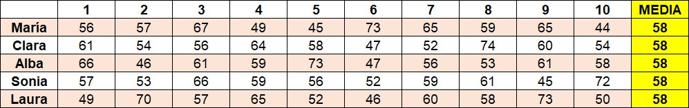{width=100%}

## Inspección visual de la dispersión {data-background-image="assets/images/basket.jpg" data-background-opacity="0.1"}

>¿Qué hacer? El entrenador está en un aprieto.

:::::::::::::: {.columns}

::: {.column width="55%"}
Ya que tenemos datos, vamos a tratar de representarlos gráficamente, a ver si con eso podemos decir algo. 

Se les proporciona a los alumnos el diagrama de puntos de una jugadora a modo de ejemplo y se les deja trabajar y discutir a qué jugadora sacar.
:::

::: {.column width="40%"}

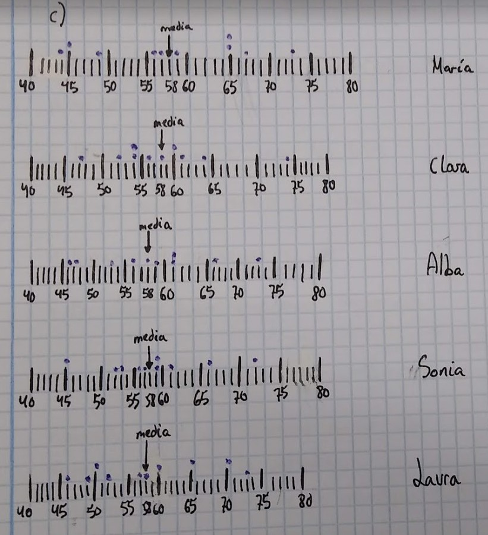{width=80%}
:::
::::::::::::::

Resulta que visualmente no se aprecia cuál es más regular, más fiable. En la puesta en común unos grupos defienden a Clara, otros a Sonia... Seguimos necesitando algo más.

## Empezamos a medir la dispersión {data-background-image="assets/images/basket.jpg" data-background-opacity="0.1"}

Vamos ahora a medir, esto es, a asignar un número a cada jugadora, a cada uno de los diagramas de puntos. 

>¿Qué podemos medir?

En efecto, lo más fácil es calcular la anchura. Esto se llama rango. ¡Todas lo tienen muy parecido! María, quizás, un poco más alto...

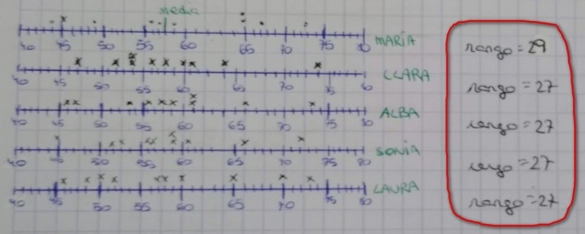{width=80%}

## ¿El rango es una buena medida de la dispersión? {data-background-image="assets/images/basket.jpg" data-background-opacity="0.1"}

- Pero… ¿qué pasaría con una jugadora que durante 8 días encestase el 58% de los tiros, pero un día le saliese malo y tuviese un 31% y otro día hiciese un gran partido con un 75% de acierto? 
- ¿Cuál es su rango? ¿Su diagrama de puntos? 
- ¿Es más o menos fiable que las anteriores?

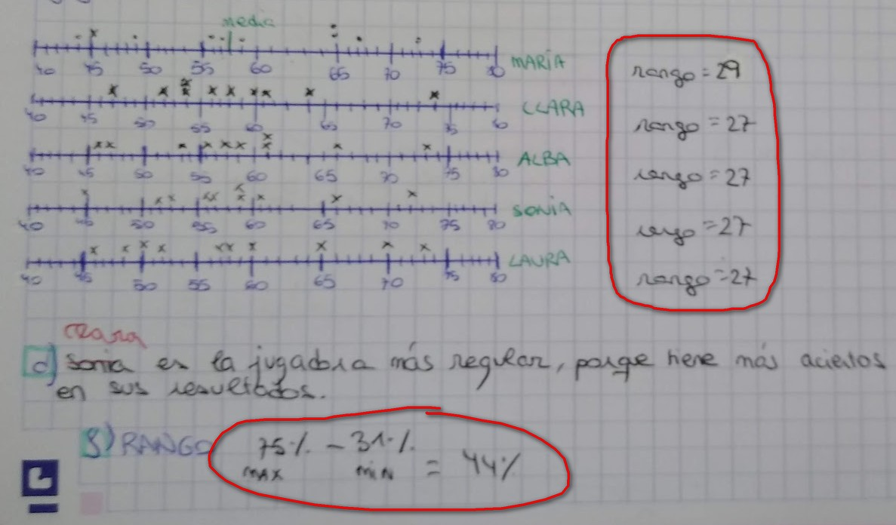{width=65%}

## ¿El rango es una buena medida de la dispersión? {data-background-image="assets/images/basket.jpg" data-background-opacity="0.1"}

¿Quién es más regular?

:::::::::::::: {.columns}

::: {.column width="45%"}

>Nueva jugadora

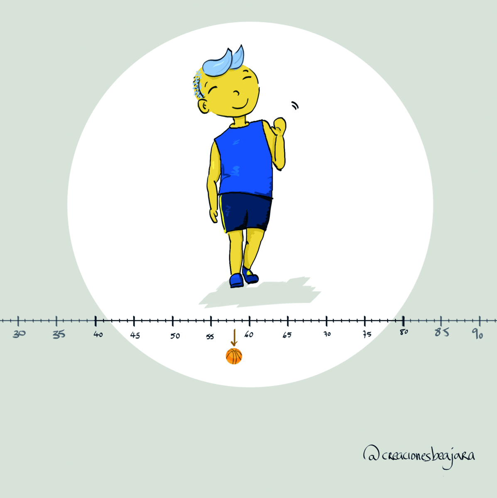{width=100%}
:::

::: {.column width="45%"}

>Sonia

{width=100%}

:::
::::::::::::::

## Necesitamos una nueva medida de la dispersión {data-background-image="assets/images/basket.jpg" data-background-opacity="0.1"}

Está claro entonces que el rango se queda corto y que necesitamos una medida mejor de la dispersión. No puede ser que una jugadora que tenga un rango de casi el doble sea más regular, fiable, menos dispersa. El rango, como medida, es una castaña.

- Necesitamos algo mejor que el rango. Así que toca charla de aula a ver qué se puede hacer. ¿No había salido antes la media? 
- Toca medir las desviaciones de cada jugadora respecto a la media. Sin embargo, al sumarlas ocurre algo ¿inesperado?

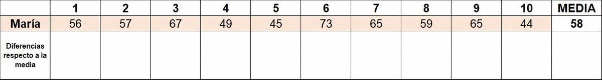{width=100%}

## Una propiedad de la media {data-background-image="assets/images/basket.jpg" data-background-opacity="0.1"}

La suma de las diferencias respecto de la media sale siempre cero. Es una propiedad de la media. Tiene sentido, pues, considerar la distancia a la media y hacer un promedio. Así obtenemos la _desviación media_.

Si ordenamos así a las jugadoras vemos que la menos regular es María (DM=7,8), y que las menos dispersas son Sonia y Clara (DM=5,4). En la puesta en común hablamos de qué significan ese 7,8 y esos 5,4.

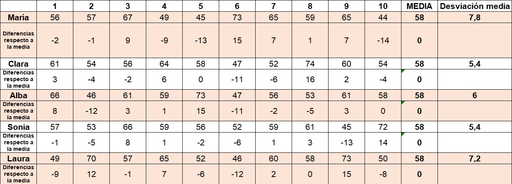{width=100%}

## Sobre la desviación media {data-background-image="assets/images/basket.jpg" data-background-opacity="0.1"}

Ahora consideramos el caso de una jugadora, Berta, que ha estado lesionada durante 2 partidos. Durante los otros 8 partidos ha acumulado una cantidad de dispersión de 67. ¿Es más regular que María?

:::::::::::::: {.columns}

::: {.column width="45%"}

- Ninguna tarea está puesta al azar. Si dividimos 67 entre 10, obtendríamos una DM de 6,7, concluyendo que es más fiable Berta. Ahora, ¿hemos tenido en cuenta que no ha jugado dos partidos?
- Ah, es que habrá que dividir para 8, ¿no? Entonces sale… 8,375, no es nada regular.

:::

::: {.column width="45%"}

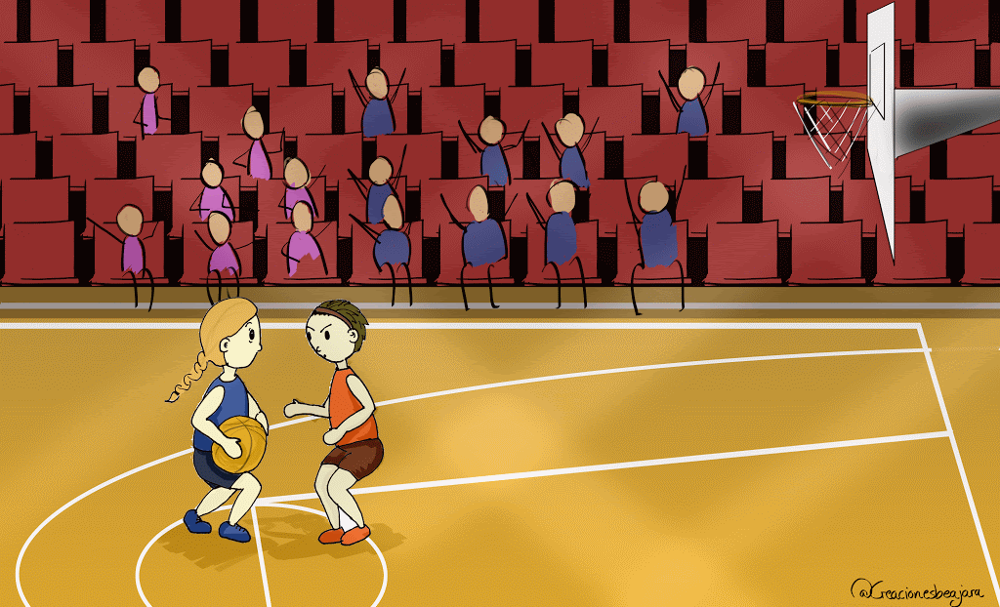{width=100%}

:::
::::::::::::::

## Introducimos la varianza {data-background-image="assets/images/basket.jpg" data-background-opacity="0.1"}

Y llegamos a la varianza. A los alumnos les hace gracia esta palabra. Toca proponer considerar los cuadrados de las desviaciones, como otra estrategia. Es un punto que, de entrada, puede parecer tener poco sentido, si ya tenemos la desviación media.

Aparece un poco forzado en la secuencia, pero tiene alguna ventaja. Como que los datos que se alejen más de la media van a tener un peso algo mayor en la medida de la dispersión. En nuestro ejemplo, nos ayuda a desempatar entre Sonia y Clara como jugadoras más fiables.

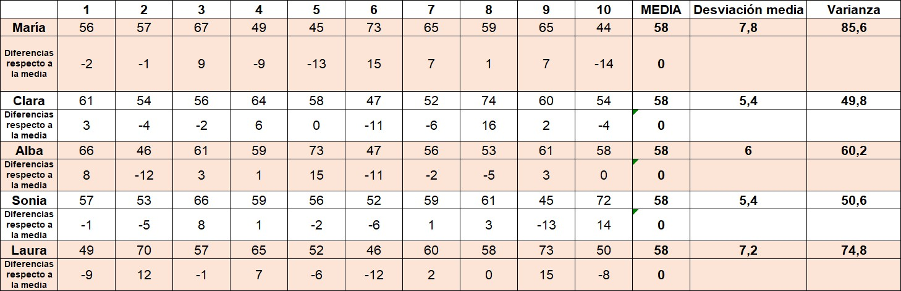{width=100%}

## Desviación típica {data-background-image="assets/images/basket.jpg" data-background-opacity="0.1"}

La más regular, la menos dispersa, es Clara. A la hora de interpretar esa varianza de 49 y pico, ¿qué? Al ser desviaciones al cuadrado no podemos decir que lo normal es que se desvíe 49 de la media de acierto. Por eso hacemos la raíz cuadrada para obtener la desviación típica.

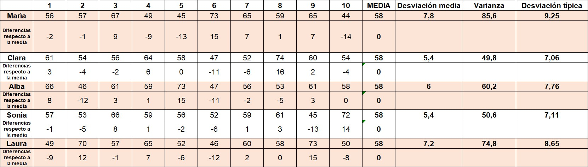{width=100%}

## Pero.. ¿qué es la dispersión? {data-background-image="assets/images/basket.jpg" data-background-opacity="0.1"}

Algunos alumnos se apuntan que anulamos el “efecto de elevar al cuadrado”. Señales de que vamos bien son:

- Oye… ¿qué es la dispersión? ¿La varianza?
- Si llevamos tres días con esto la dispersión.
- Ya... pero no sé si es la varianza o la desviación típica.

>Toca otra puesta en común. Se suelen reservar momentos para ello, pero si surge algo interesante, es el docente el que decide parar la actividad. Podemos decir que la dispersión es lo concentrados o alejados que están los datos respecto de la media (recordamos los gestos).

Una cosa distinta es cómo midamos esas dispersión. 

## ¿A quién elegimos entonces?  {data-background-image="assets/images/basket.jpg" data-background-opacity="0.1"}

:::::::::::::: {.columns}

::: {.column width="45%"}

Entonces… ¿a quién elegimos si queda un minuto y ganamos de 2 puntos? A la más fiable, claro, no queremos pifiarla. 

El entrenador tiene que sacar a Sonia.

:::

::: {.column width="45%"}

Pero… ¿si vamos perdiendo de 8 puntos? Necesitamos un milagro, no vale con no pifiarla. Sacaremos a María, que teniendo la misma media que Sonia, es mucho más irregular. ¡Le puede salir uno de esos partidos en que mete todo!

:::
::::::::::::::

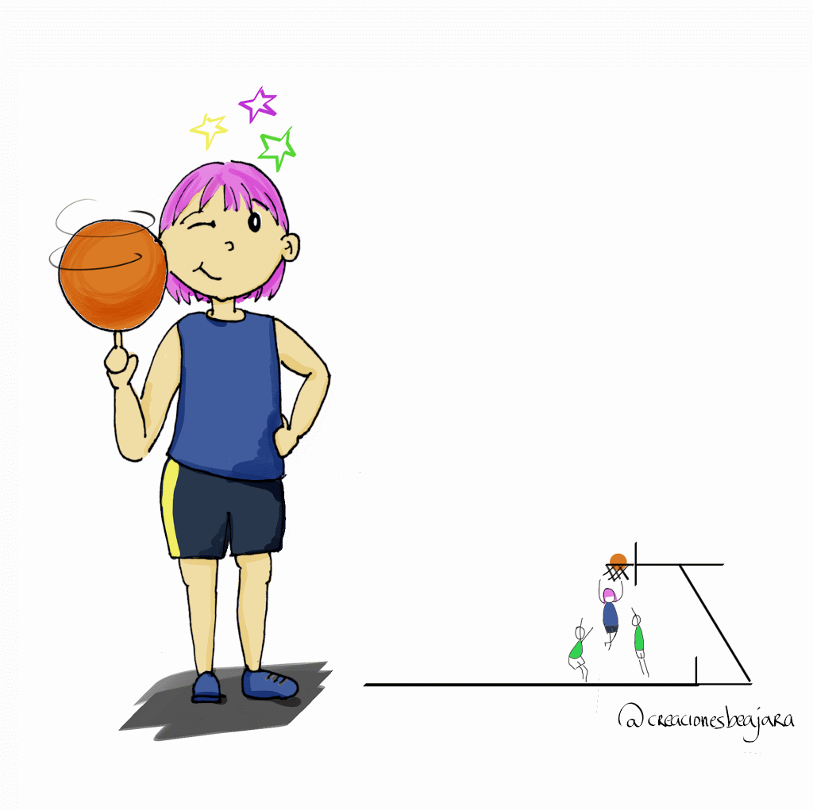{width=30%}

## Una propuesta de gestión a distancia  {data-background-image="assets/pc.jpg" data-background-opacity="0.1"}

>Una propuesta de gestión de este tipo de actividades es la siguiente, que es la que hemos seguido en el CPI Val de la Atalaya durante el confinamiento.

1. Trabajo autónomo 
2. Puesta en común (vídeo o vídeoconferencia) 
3. Reentrega de lo anterior con lo tratado en la videoconferencia y, en su caso, vuelta al punto 1 para continuar con la siguiente parte de la actividad.
4. Autoevaluación

Lo normal han sido actividades en uno o dos ciclos. Solo en una hubo que dividir el trabajo en tres partes. En la tarea de la dispersión, un buen punto para empezar la segunda parte es después de la comparación visual.

## Dudas durante el trabajo autónomo {data-background-image="assets/pc.jpg" data-background-opacity="0.1"}

El trabajo autónomo se desarrolla durante tres o cuatro días lectivos aproximadamente, con un fin de semana en medio. Claro que hay dudas y entregas incompletas. Hay dos tipos de dudas: ilegítimas y legítimas. En estas últimas se nota que se ha leído la tarea y que se ha trabajado.

:::::::::::::: {.columns}

::: {.column width="45%"}

>:x: Ejemplo de duda ilegítima

A las que contestamos que leáis las instrucciones y seáis concretos: 

_¿Me puedes explicar las tareas 1, 2 y 3?_

:::

::: {.column width="45%"}

>:heavy_check_mark: Ejemplo de duda legítima:

Este ejemplo de duda es lo que esperamos si una de las tareas "no os sale".

_Se me hace imposible encontrar la mejor jugadora, todas tienen la misma media._

:::
::::::::::::::

## Autoevaluación {data-background-image="assets/pc.jpg" data-background-opacity="0.1"}

Con una herramienta para pasar formularios, les preguntamos, en primer lugar, por lo siguiente:

1. Necesito más tiempo para entender esto o necesito un ejemplo delante para poder hacerlo.
2. Puedo hacer esto por mi cuenta, pero hay cosas que no entiendo, me falta una explicación y/o estoy cometiendo errores de cálculo.
3. Puedo hacer esto por mi cuenta sin errores y explicar o mostrar cómo lo resolví.
4. Puedo hacer esto por mi cuenta sin errores, explicar o mostrar cómo lo resolví, y explicar qué significa mi solución o hacer alguna observación adicional.

Estas puntuaciones podrían servir en un esquema de calificación. Si se observan discrepancias con otros instrumentos de evaluación, entrevista con el alumno.

## Autoevaluación {data-background-image="assets/pc.jpg" data-background-opacity="0.1"}

>Preguntas abiertas

- Escribe un párrafo donde describas qué dificultad has tenido en la realización de esta tarea
- ¿Qué he aprendido? Escribe un breve párrafo que describa qué has aprendido.
- ¿Qué me gustaría aprender? Escribe un breve párrafo escribiendo algo interesante que hayas observado mientras hacías la tarea y por lo que te preguntas.

El alumnado tiene que aprender a hacer bien estas autoevaluaciones. 

- En las videoconferencias (en el caso de emergencia) se comenta lo que ponen. 
- No vale: no lo entiendo o al principio mal y luego bien.

## Tarea a realizar en el taller (actividad D2){data-background-image="assets/pc.jpg" data-background-opacity="0.18"}

Al hacer este tipo de actividades, la clave es la puesta en común.

- En este [zip]() tienes diversas producciones de alumnos de esta actividad.
- Graba un breve vídeo de 3-5 minutos de duración (no hace falta que aparezcas, es suficiente con la voz) donde comentes algunas de esas producciones. 
- Recuerda que suponemos que es un vídeo dirigido a los alumnos que han realizado esas producciones; es decir, una puesta en común.
- Puede ser, por ejemplo, para poner en común la introducción del problema y la inspección visual de la dispersión.
- Utiliza el software de captura que quieras, no tiene por qué editarse el vídeo. Si tienes alguna duda técnica al respecto, podemos comentarla en el foro de dudas.
- Comparte el vídeo a través de la plataforma que quieras (por ejemplo, YouTube, de manera privada, si lo deseas) y pon la dirección del vídeo en la entrega.

# D3: Dos tipos de actividades sobre gráficos estádisticos {data-background-image="assets/images/stats.jpg" data-background-opacity="0.18"}

## Contenidos del D3 (gráficos estadísticos) {data-background-image="assets/images/stats.jpg" data-background-opacity="0.1"}

- [¿Qué pasa con este gráfico?]
- [Gráficos que se revelan lentamente]
- [¿Hablar sobre gráficos a distancia?]
- [Tarea a realizar en el taller (actividad D3)]

## ¿Qué pasa con este gráfico? {data-background-image="assets/images/stats.jpg" data-background-opacity="0.1"}

:::::::::::::: {.columns}

::: {.column width="35%"}
El New York Times lleva colaborando desde 2017 con la _American Statistical Association_ para ofrecer la sección [What's Going On in This Graph](https://www.nytimes.com/column/whats-going-on-in-this-graph) 

{width=100%}

:::

::: {.column width="60%"}

>Semanalmente, de septiembre a mayo, proponen un gráfico sobre un tema de actualidad, con el objetivo de facilitar la siguiente discusión, cuyas preguntas han de abordarse en orden.

1. _¿Qué observas?_ Si haces una observación, tienes que decir de dónde viene.
2. _¿Qué te preguntas?_ De lo que has observado en el gráfico, ¿qué te produce curiosidad?
3. _¿Qué pasa con este gráfico?_ Redacta un titular con gancho que capture la idea principal del gráfico.

:::
::::::::::::::

## ¿Qué pasa con este gráfico? (2) {data-background-image="assets/images/stats.jpg" data-background-opacity="0.1"}

- A los seis días, organizan una discusión en directo con alumnado de diversas partes del mundo, moderada por miembros de la A.S.A.
- No obstante, se puede contribuir en cualquier momento a esas discusiones.
- Al final de la semana, se revela la actividad completa, con información adicional sobre el contexto, titulares que han puesto los alumnos, y con las ideas estadísticas relevantes.

>Más allá de todo esto, se trata de una actividad que, llevada al aula, facilita charlas de aula muy interesantes sobre interpretación de gráficos estadísticos. No son gráficos simples. Además, aparecen conceptos relevantes.

[Página del NY Times con estas actividades organizadas por temas](https://www.nytimes.com/2020/06/10/learning/over-60-new-york-times-graphs-for-students-to-analyze.html)

## ¿Qué pasa con este gráfico? (3) {data-background-image="assets/images/stats.jpg" data-background-opacity="0.1"}

Un ejemplo. Antes del confinamiento de 2020 por COVID-19, tuvimos ocasión de discutir este gráfico en clase. Antes de seguir, piensa ¿qué observas?, ¿qué te preguntas? y ¿qué titular le pondrías? 

{width=75%}

Imagen: [NY Times](https://www.nytimes.com/2020/02/18/learning/whats-going-on-in-this-graph-coronavirus-outbreak.html)

## ¿Qué pasa con este gráfico? (4) {data-background-image="assets/images/stats.jpg" data-background-opacity="0.1"}

Algunas cosas que surgieron, en un 2º de ESO, fueron (además de preguntarnos por la traducción de alguna enfermedad :wink:)

>¿Qué observas?

- El coronavirus aparece como un rectángulo.
- MERS y SARS están en negrita.
- El eje vertical no es proporcional (estábamos terminando de ver esta unidad).
- Hay dos enfermedades que están en el eje horizontal. 

## ¿Qué pasa con este gráfico? (5) {data-background-image="assets/images/stats.jpg" data-background-opacity="0.1"}

:::::::::::::: {.columns}

::: {.column width="45%"}
>¿Qué te preguntas?

- ¿Por qué el eje vertical no es proporcional? 
- ¿Qué significa la tasa de mortalidad? Aquí enlazamos con el significado de razón del número racional y fue muy interesante, muy relacionado con lo que estábamos viendo. De cada 100 infectados, tantos que fallecen.

:::

::: {.column width="45%"}
> ¿Qué pasa con este gráfico? 

- La incertidumbre del coronavirus.
- ¿Cómo se compara el COVID-19 con otras enfermedades?
- Etc.

:::
::::::::::::::

En la web del [NY Times](https://www.nytimes.com/2020/02/18/learning/whats-going-on-in-this-graph-coronavirus-outbreak.html) se puede ver la propuesta final (el _reveal_).

## Gráficos que se revelan lentamente {data-background-image="assets/images/stats2.jpg" data-background-opacity="0.06"}

>Es un tipo de actividad muy relacionada con la anterior. El objetivo es el mismo, facilitar discusiones ricas de aula alrededor de un gráfico estadístico.

- La actividad consiste en mostrar un gráfico sin dar información sobre el contexto ni etiquetas en los ejes ni nada.
- Se produce una charla de aula sobre lo que se observa en el gráfico, lo que pueden representar las barras, los colores, etc.
- Posteriormente, se aporta algún detalle, como las etiquetas de uno de los ejes, y se prosigue.
- Así hasta que se revela completamente el gráfico.

. . .

> Veamos un ejemplo...

## Gráficos que se revelan lentamente (2) {data-background-image="assets/images/stats2.jpg" data-background-opacity="0.06"}

¿Qué observas? Intenta ir contestando mentalmente a las preguntas.

{width=100%}

Fuente del gráfico original: [\@picanumeros](https://picanumeros.wordpress.com/2019/12/09/brecha-de-genero-en-los-estudios-evolucion-del-de-mujeres-matriculadas-en-carreras-universitarias-publicas-desde-1985-a-2014/)

## Gráficos que se revelan lentamente (3){data-background-image="assets/images/stats2.jpg" data-background-opacity="0.06"}

- ¿Qué significan esos colores? La anchura va cambiando, ¿qué puede ser?
- Aquí hay que mojarse y proponer algo: ¿países? ¿animales?

. . .

Esta nueva información, ¿qué añade o cambia a lo que pensabas?

{width=100%}

## Gráficos que se revelan lentamente (4) {data-background-image="assets/images/stats2.jpg" data-background-opacity="0.06"}

¿Y ahora?

{width=100%}

## Gráficos que se revelan lentamente (5) {data-background-image="assets/images/stats2.jpg" data-background-opacity="0.06"}

¿Qué observas? ¿Qué te preguntas?

{width=100%}

## Gráficos que se revelan lentamente (6) {data-background-image="assets/images/stats2.jpg" data-background-opacity="0.06"}

¿Y el resto de colores? ¿Qué pueden significar? ¿Intuimos qué puede estar mostrando este gráfico?

{width=100%}

## Gráficos que se revelan lentamente (7) {data-background-image="assets/images/stats2.jpg" data-background-opacity="0.06"}

Solo nos falta qué significa el eje vertical y lo más importante, de qué va el gráfico.

{width=100%}

## Gráficos que se revelan lentamente (8) {data-background-image="assets/images/stats2.jpg" data-background-opacity="0.06"}

¿Podemos decir ya qué nos está mostrando el gráfico?

{width=100%}

## Gráficos que se revelan lentamente (9) {data-background-image="assets/images/stats2.jpg" data-background-opacity="0.06"}

¿Cuándo has empezado a pensar que el gráfico iba sobre elección de carreras universitarias por género?

{width=100%}

## Gráficos que se revelan lentamente (10) {data-background-image="assets/images/stats2.jpg" data-background-opacity="0.06"}

- Como profesores, debemos evitar desvelar directamente lo que muestra el gráfico. Aquí, el docente actúa como moderador, anotando en la pizarra las contribuciones y haciendo las preguntas adecuadas. Dar tiempo.
- Conforme van apareciendo ideas, sí que hemos de relacionarlas con conceptos ya vistos. Igualmente, al final, se pueden subrayar los conceptos estadísticos relevantes que hayan salido.
- Enlaces para usar en el aula a la actividad de la elección de género en carreras universitarias para [mujeres](https://pbeltran.github.io/slowreveal-carrerasmujeres/) y para [hombres](https://pbeltran.github.io/slowreveal-carrerashombres/), que se pueden plantear en paralelo. Incluso, que unos equipos de alumnos trabajen con una y otros con la otra.
- [Slow Reveal Graphs](https://slowrevealgraphs.com/), gestionada por [\@jennalaib](https://twitter.com/jennalaib), es otra de esas fantásticas páginas especializadas en un único tipo de recurso.
- Ben Orlin en su [Math with bad drawings](https://mathwithbaddrawings.com/2020/06/03/what-graphs-reveal-if-you-give-them-the-time/) escribía hace poco sobre los gráficos que se revelan lentamente.

## ¿Hablar sobre gráficos a distancia? {data-background-image="assets/images/stats2.jpg" data-background-opacity="0.1"}

>¿Cómo podemos adaptar estas actividades a una modalidad distancia?

- De una forma similar a la propuesta con los WODB, sabiendo que se pierde interacción.
- Se puede plantear en paralelo con otras actividades, pero dejando tiempo entre una pregunta y otra.
- Por ejemplo, si se habilita un foro, dejar un día para que el alumnado conteste a ¿qué observas?, y luego pasar a la siguiente. O, en el caso de los gráficos que se revelan poco a poco, dejando tiempo entre uno y otro.

## Tarea a realizar en el taller (actividad D3){data-background-image="assets/pc.jpg" data-background-opacity="0.18"}

Elige uno de los dos tipos de actividades y entrega un documento pdf

:::::::::::::: {.columns}

::: {.column width="45%"}

>¿Qué pasa con este gráfico?

- Diseña una actividad de este tipo a partir de un tema de actualidad.
- Para ello, busca o construye un gráfico que dé lugar a una buena charla de aula.
- En tu documento, incluye tanto la actividad como posibles intervenciones del alumnado.

:::

::: {.column width="45%"}

>Gráficos que se revelan poco a poco

- Diseña una actividad de este tipo, eligiendo un gráfico que de juego a ser descubierto poco a poco.
- En tu documento, incluye imágenes de cómo se va revelando el gráfico y posibles planteamientos del alumnado.

:::
::::::::::::::

# Créditos y referencias {data-background-image="assets/credits.jpg" data-background-opacity="0.1"}

## Lista de referencias {data-background-image="assets/credits.jpg" data-background-opacity="0.1"}

Batanero, C., & Godino, J. D. (2003). _Estocástica y su didáctica para maestros_. Departamento de Didáctica de las Matemáticas. Universidad de Granada. [Enlace.](https://www.ugr.es/~jgodino/edumat-maestros/manual/6_Estocastica.pdf)

Cai, J. (2003). What research tells us about teaching mathematics through problem solving. Research and issues in teaching mathematics through problem solving, 241-254.

English, L. D., & Gainsburg, J. (2016). Problem Solving in a 21st-Century Mathematics Curriculum. En L.D. English, & D. Kirshner, _Handbook of international research in mathematics education_ (p. 326). New York: Routledge.

## {data-background-image="assets/credits.jpg" data-background-opacity="0.1"}

Gaulin, C. (2001). Tendencias actuales de la resolución de problemas. _Sigma, 19_, 51-63. [Enlace](http://www.hezkuntza.ejgv.euskadi.eus/r43-573/es/contenidos/informacion/dia6_sigma/es_sigma/adjuntos/sigma_19/7_Tendencias_Actuales.pdf)

Hunter, C. (2018). Alike and Different: Which One Doesn’t Belong? and More. _Vector, 60_(1), 17–20. 

Ricart, M., Beltrán-Pellicer, P., Estrada, A. (2019). Actividad scaffolding en geometría para desarrollar habilidades de argumentación y clasificación en futuros maestros de Educación Infantil. Investigación en Educación Matemática XXIII (pp. 503-512). [Enlace.](https://tierradenumeros.com/publication/201909-seiem-wodb/201909-seiem-wodb.pdf)

## Créditos {data-background-image="assets/credits.jpg" data-background-opacity="0.1"}

_Compartir el conocimiento de forma libre es una buena práctica._

En estas diapositivas se han utilizado materiales disponibles en abierto y se han citado las fuentes correspondientes. El contenido de la presentación está publicado con licencia Creative Common [CC-BY-SA-4.0](https://creativecommons.org/licenses/by-sa/4.0/legalcode.es), lo que quiere decir que puedes compartirla y adaptarla, citándome (Pablo Beltrán-Pellicer) y poniendo un enlace a la presentación.

_Siéntete libre de trabajar con este material y de contactar conmigo para compartir tus reflexiones._

## {data-background-image="assets/credits.jpg" data-background-opacity="0.1"}

Presentación realizada con  <a href="https://revealjs.com/#/">Reveal.js</a>, <a href="https://pandoc.org/">Pandoc</a>, <a href="https://www.mathjax.org/">MathJax</a> y <a href="https://www.markdownguide.org/">Markdown</a>. El código fuente está disponible en [https://github.com/pbeltran](https://github.com/pbeltran/)

Los gifs e imágenes de la tarea 2 (la del baloncesto) son de Beatriz J. Beltrán Pellicer [\@creacionesbjara](https://twitter.com/creacionesbjara).

La fuente de las imágenes es propia, salvo las que se ha citado la fuente en su diapositiva y las de dominio público obtenidas en [Unsplash](https://unsplash.com).

